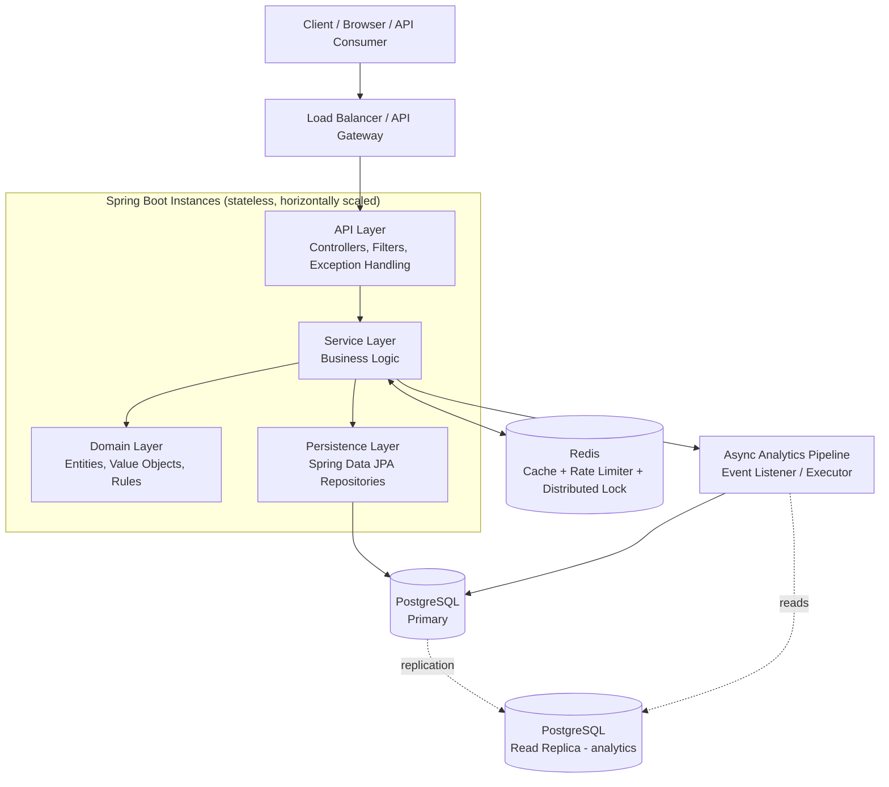
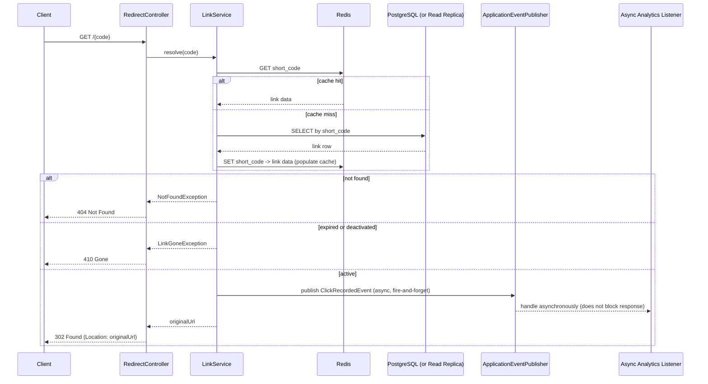
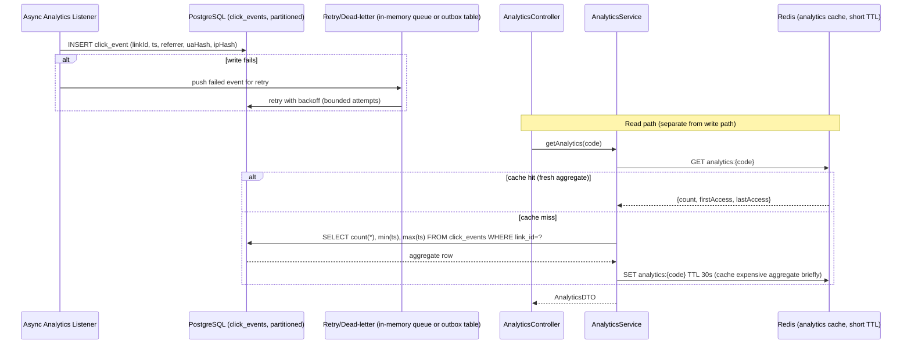

# Architecture: URL Shortener System

**Stack:** Java 21 · Spring Boot 3.x · PostgreSQL · Redis
**Companion docs:** [RequirementAnalysis.md](./RequirementAnalysis.md) · [TaskBreakdown.md](./TaskBreakdown.md)

## 0. High-Level Overview



Design intent: the **redirect path** (highest volume, latency-sensitive) is optimized independently from the **create path** and the **analytics path**, which are lower-volume or can tolerate asynchronous processing. This separation is the central architectural decision.

---

## 1. Layers

| Layer | Responsibility | Key Spring/Java Constructs |
|-------|----------------|------------------------------|
| **API / Presentation** | HTTP contract, request/response mapping, input validation, exception translation | `@RestController`, `@RestControllerAdvice`, Bean Validation (`jakarta.validation`), `Filter`/`HandlerInterceptor` for rate limiting |
| **Application / Service** | Orchestrates use cases (create link, redirect, get analytics), transaction boundaries, cache coordination | `@Service`, `@Transactional`, `CacheManager` |
| **Domain** | Core business rules and invariants (short-code format, expiration rules, alias validation) independent of framework/persistence concerns | POJOs / records, domain services with no Spring annotations where feasible |
| **Persistence** | Data access abstraction over PostgreSQL | Spring Data JPA `Repository` interfaces, `@Entity` mappings, Flyway/Liquibase migrations |
| **Caching** | Read-through/write-through cache for hot link lookups, distributed rate-limit counters, distributed locks for collision avoidance | Spring Data Redis, `RedisTemplate`/Lettuce client, Redisson (optional, for locks) |
| **Async/Integration** | Decouples analytics recording and cleanup jobs from the request/response cycle | `@Async` + dedicated `ThreadPoolTaskExecutor`, Spring `ApplicationEventPublisher`, `@Scheduled` for expiry sweeps |
| **Cross-cutting** | Security, observability, configuration | Spring Security, Spring Boot Actuator, Micrometer, `@ConfigurationProperties`, resilience4j |

Layer dependency direction is strictly top-down (API → Service → Domain/Persistence). Domain layer has **no outward dependencies**, enabling unit testing without Spring context.

---

## 2. Components & Responsibilities

### 2.1 API Layer
- `LinkController` — `POST /api/v1/links`, `GET /api/v1/links/{code}` (metadata), `DELETE /api/v1/links/{code}` (deactivate)
- `RedirectController` — `GET /{code}` (public redirect endpoint, separate from `/api/v1` namespace to keep short URLs clean, e.g. `https://short.example/abc123`)
- `AnalyticsController` — `GET /api/v1/links/{code}/analytics`
- `HealthController` — delegated to Spring Boot Actuator (`/actuator/health`, `/actuator/health/liveness`, `/actuator/health/readiness`)
- `GlobalExceptionHandler` (`@RestControllerAdvice`) — maps domain exceptions to HTTP status (400/404/409/410/429/500) with a consistent error body shape, never leaking stack traces
- `RateLimitFilter` — `OncePerRequestFilter` backed by Redis (token bucket via Resilience4j `RateLimiter` + Redis, or Bucket4j-Redis)

### 2.2 Service Layer
- `LinkService` — orchestrates create/read/deactivate use cases; owns cache-aside logic (check Redis → fallback DB → populate Redis)
- `ShortCodeGeneratorService` — generates short codes (Base62-encoded sequence or random-with-retry); enforces custom alias validation for the brownfield alias feature
- `AnalyticsService` — records click events (delegates to async pipeline) and serves aggregate queries
- `UrlValidationService` — scheme allow-list, private/internal IP blocking (SSRF/open-redirect mitigation), length limits

### 2.3 Domain Layer
- `Link` (entity/aggregate root): id, shortCode, originalUrl, createdAt, expiresAt, status (ACTIVE/EXPIRED/DEACTIVATED), createdBy (future)
- `ClickEvent` (value object): linkId, timestamp, referrer, userAgentHash, ipHash (hashed, not raw, per privacy consideration)
- Domain rules: `Link.isRedirectable()` encapsulates expiry/status checks so this logic exists in exactly one place

### 2.4 Persistence Layer
- `LinkRepository extends JpaRepository<Link, Long>` with a unique index on `short_code`
- `ClickEventRepository` — append-only writes; partitioned by month (see Scalability) for analytics scale
- Flyway migrations versioned under `db/migration` — schema changes are never applied ad hoc

### 2.5 Caching Layer (Redis)
- **Link cache:** `short_code -> {originalUrl, status, expiresAt}`, TTL slightly beyond link expiry, invalidated on deactivation
- **Rate limiter counters:** per-IP/per-API-key sliding window counters for `POST /links`
- **Distributed lock (optional, only if moving off DB-sequence-based codes):** short-lived lock during code generation to avoid race conditions across instances
- Cache is **read-through on redirect, write-through on create**; cache is a performance optimization, never the system of record

### 2.6 Async/Integration Layer
- Redirect success publishes a `ClickRecordedEvent` via `ApplicationEventPublisher`
- `@Async` listener persists the event to `ClickEventRepository` using a dedicated bounded thread pool (isolated from the request-handling pool so analytics backpressure never blocks redirects)
- `@Scheduled` job periodically flips expired `Link` rows to `EXPIRED` status (cache invalidation triggered on change) — keeps redirect-path expiry checks cheap (status flag vs. computing expiry every request)

---

## 3. Request Flow — Create Short Link

```mermaid
sequenceDiagram
    participant C as Client
    participant F as RateLimitFilter
    participant Ctrl as LinkController
    participant Val as UrlValidationService
    participant Svc as LinkService
    participant Gen as ShortCodeGeneratorService
    participant DB as PostgreSQL
    participant R as Redis

    C->>F: POST /api/v1/links {longUrl, alias?, ttl?}
    F->>F: Check rate limit (Redis counter)
    alt limit exceeded
        F-->>C: 429 Too Many Requests
    else within limit
        F->>Ctrl: forward request
        Ctrl->>Val: validate(longUrl)
        alt invalid URL / disallowed scheme / private IP
            Val-->>Ctrl: ValidationException
            Ctrl-->>C: 400 Bad Request
        else valid
            Ctrl->>Svc: createLink(longUrl, alias, ttl)
            Svc->>Gen: generate or validate alias
            Gen->>DB: uniqueness check / insert with unique constraint
            alt collision
                DB-->>Gen: constraint violation
                Gen->>Gen: retry (generated codes only; alias collision -> 409)
            end
            Svc->>DB: persist Link (status=ACTIVE)
            Svc->>R: cache short_code -> link data (write-through)
            Svc-->>Ctrl: Link DTO
            Ctrl-->>C: 201 Created {shortUrl, code, expiresAt}
        end
    end
```

---

## 4. Redirect Flow



Key property: the response is returned **before** analytics persistence completes. A slow or failing analytics write never increases redirect latency or causes a redirect failure.

---

## 5. Analytics Flow



- Raw events are the source of truth; aggregates are computed on read (with a short-TTL cache to absorb bursty polling) rather than maintained as a separately-updated counter, avoiding double-write consistency issues at this scale.
- At higher scale (see Future Extensibility), this shifts to a pre-aggregated rollup table updated by a scheduled/streaming job.

---

## 6. Scalability Considerations

| Concern | Approach |
|---------|----------|
| **Stateless app tier** | Spring Boot instances hold no session state; horizontal scaling behind the load balancer is trivial. |
| **Redirect hot path** | Redis cache-aside absorbs the vast majority of redirect reads, keeping PostgreSQL load low even under high read/write skew. |
| **DB connection pressure** | HikariCP pool sized per instance; PgBouncer (or equivalent) in front of PostgreSQL if instance count grows. |
| **Short code generation contention** | Prefer DB-sequence + Base62 encoding (monotonic, no cross-instance coordination needed) over pure random-with-retry at high write volume; unique constraint remains the correctness backstop either way. |
| **Analytics write volume** | Async isolation today; `click_events` table time-partitioned (e.g., monthly) to keep indexes small and enable cheap retention/archival (drop old partitions instead of deleting rows). |
| **Analytics read scale** | Route aggregate queries to a PostgreSQL read replica; short-TTL Redis cache absorbs repeated polling of the same code. |
| **Read/write separation** | Primary handles link creation + redirect lookups (cache absorbs most); replica handles analytics reporting queries, isolating reporting load from the critical path. |
| **Rate limiting at scale** | Redis-backed counters are shared across all app instances, so limits are enforced cluster-wide, not per-instance. |
| **Geo/multi-region (future)** | Redis and Postgres can be regionalized with read replicas per region; redirect path is the primary candidate for multi-region deployment given its latency sensitivity. |

---

## 7. Security Considerations

| Area | Control |
|------|---------|
| **Open redirect / SSRF** | `UrlValidationService` enforces an http/https scheme allow-list and blocks loopback/link-local/private IP ranges (RFC 1918, 127.0.0.0/8, 169.254.0.0/16) before a URL is ever persisted. |
| **Injection** | All persistence via Spring Data JPA parameterized queries; no string-concatenated SQL. |
| **Abuse / spam link creation** | Redis-backed rate limiting per IP/API key on `POST /links`; optional CAPTCHA/API-key requirement for anonymous public deployments. |
| **AuthN/AuthZ (management endpoints)** | Spring Security with API-key or OAuth2/JWT bearer tokens for create/deactivate/analytics endpoints; public redirect endpoint (`GET /{code}`) remains unauthenticated by design. |
| **Transport security** | TLS terminated at the load balancer/ingress; internal service-to-DB/Redis traffic on a private network/VPC. |
| **Secrets management** | DB/Redis credentials and JWT signing keys externalized via environment variables or a secrets manager (Vault/AWS Secrets Manager/Azure Key Vault) — never committed to source. |
| **PII minimization** | Click events store a **hashed** IP and hashed/truncated user-agent rather than raw values, reducing privacy exposure while retaining uniqueness for basic analytics. |
| **Error handling** | `GlobalExceptionHandler` returns generic error messages to clients; full stack traces only in server-side logs. |
| **Dependency hygiene** | Regular `mvn dependency-check` / Snyk/OWASP dependency-check scans in CI as a quality gate. |
| **Header injection** | Redirect `Location` header value is built from the validated stored URL only, never from unsanitized request input, preventing header/CRLF injection. |
| **Malicious link screening (future)** | Hook point identified for an external URL-reputation check (e.g., Google Safe Browsing) prior to activation — not implemented in prototype, documented as a limitation. |

---

## 8. Failure Handling

| Failure Scenario | Handling Strategy |
|-------------------|--------------------|
| **Redis unavailable** | Resilience4j circuit breaker wraps cache calls; on open circuit, service falls back to direct PostgreSQL reads for redirects (degraded latency, not degraded correctness). Rate limiting fails **open or closed** based on a configurable policy (documented trade-off: fail-open favors availability, fail-closed favors abuse-prevention). |
| **PostgreSQL primary unavailable** | Health check marks instance unready (`/actuator/health/readiness`) so the load balancer stops routing traffic; connection retries with exponential backoff via HikariCP; read replica can serve analytics reads independently if primary is degraded but replica is healthy. |
| **Analytics write failure** | Fire-and-forget async write never fails the redirect response; failed events pushed to a retry queue/outbox with bounded backoff; persistent failures logged and surfaced via metrics/alerting rather than silently dropped. |
| **Short code collision** | Unique DB constraint is the authoritative guard; generator catches the constraint violation and retries with a new code (generated codes) or returns 409 Conflict (user-supplied alias). |
| **Duplicate/idempotent create requests** | Optional `Idempotency-Key` header support: repeated requests with the same key return the original created link instead of creating duplicates. |
| **Partial/slow downstream dependency** | Timeouts configured on all outbound calls (DB, Redis); Resilience4j `TimeLimiter` prevents thread pool exhaustion from a single slow dependency. |
| **Expired link accessed** | Handled as an explicit domain state (`EXPIRED`/`DEACTIVATED`), returning 410 Gone rather than a generic error, giving clients an actionable, documented response. |
| **Unhandled exceptions** | `GlobalExceptionHandler` catches all uncaught exceptions, logs full context server-side, returns a generic 500 with a correlation/trace ID for support diagnosis. |
| **Thread pool exhaustion (async analytics)** | Dedicated, bounded executor for analytics events, separate from the main request-handling pool, so a backlog in analytics processing cannot starve redirect/create request handling. |

---

## 9. Future Extensibility

- **Streaming analytics pipeline:** Replace direct DB writes with Kafka (or equivalent) ingestion for click events, enabling real-time dashboards and decoupling producers/consumers at much higher scale.
- **Pre-aggregated rollups:** Introduce a scheduled/streaming job maintaining hourly/daily rollup tables, moving analytics reads off raw event scans entirely.
- **Custom domains / branded links:** Extend `Link` with a `domain` attribute and route via a domain-aware redirect resolver.
- **User accounts & ownership:** Add `User`/`ApiKey` entities, link ownership, and per-user analytics dashboards — builds on the AuthN/AuthZ hook already present in the API layer.
- **Malicious URL screening:** Integrate an external reputation API at creation time (async pre-check or periodic re-scan of active links).
- **Multi-region deployment:** Regionalize Redis/Postgres read replicas with geo-routing at the load balancer for lower redirect latency globally.
- **GraphQL or BFF layer:** Add alongside REST for richer client-driven analytics queries without proliferating REST endpoints.
- **Bulk operations API:** Batch link creation/deactivation for enterprise/API-heavy consumers.
- **QR code generation:** Stateless derived feature off the existing short-code/URL data, addable without core architecture changes.

---

## 10. Traceability to Requirements

This architecture directly satisfies:
- FR-1–FR-10 and NFRs in [RequirementAnalysis.md](./RequirementAnalysis.md) (performance via caching, security via validation/rate-limiting, reliability via async isolation and circuit breakers).
- Mitigates R1 (collision), R2 (open redirect/SSRF), R3 (analytics write contention), R8 (malicious links — flagged as future work), R9 (PII — hashed fields) from the risk register.
- Provides the architectural basis for Task Breakdown items T03–T18 in [TaskBreakdown.md](./TaskBreakdown.md).
