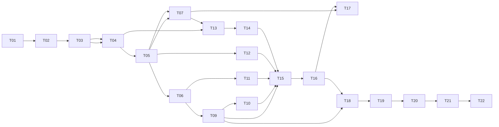

# Task Breakdown: URL Shortener (3-Day Execution Plan)

**Source:** [RequirementAnalysis.md](./RequirementAnalysis.md)
**Timebox:** 3 days (~6-7 focused hours/day, ~20 hours total)
**Sequencing principle:** Each task lists hard dependencies. Tasks within a day can be reordered if dependencies allow, but the day groupings reflect a critical path: scaffolding → core API → analytics/reliability → brownfield/ambiguous scenarios → hardening/docs.

---

## Day-at-a-glance

| Day | Theme | Tasks |
|-----|-------|-------|
| 1 | Foundation & Greenfield Core | T01–T08 |
| 2 | Analytics, Reliability, Brownfield Scenario | T09–T15 |
| 3 | Ambiguous Scenario, Hardening, Docs, Sign-off | T16–T22 |

---

## Day 1 — Foundation & Greenfield Core

### T01 — Project Scaffolding & Tooling
- **Goal:** Initialize repo structure, chosen stack, dependency manager, linter/formatter, test runner, and a runnable "hello world" API server.
- **Estimated effort:** 1 hr
- **Dependencies:** None (first task)
- **Acceptance Criteria:**
  - [ ] Repo builds/runs with a single documented command.
  - [ ] Linter and formatter configured and passing on empty scaffold.
  - [ ] Test runner executes (even with 0 tests) without error.
  - [ ] `.gitignore`, README stub, and folder structure (api/business logic/persistence separation) in place.
- **Suggested Git Commit Name:** `chore: scaffold project structure, tooling, and CI-ready config`

### T02 — API Contract Definition (OpenAPI/Schema)
- **Goal:** Define request/response schemas for create, redirect, get-metadata, and analytics-query endpoints before implementation.
- **Estimated effort:** 1 hr
- **Dependencies:** T01
- **Acceptance Criteria:**
  - [ ] OpenAPI (or equivalent schema doc) covers all FR-1–FR-10 endpoints from RequirementAnalysis.md.
  - [ ] Error response shapes (400/404/410/429) documented.
  - [ ] Reviewed against assumptions A2, A5, A6, A7 for consistency.
- **Suggested Git Commit Name:** `docs: add OpenAPI contract for shortener, redirect, and analytics endpoints`

### T03 — Data Model & Persistence Layer
- **Goal:** Design and implement the schema/tables for links (short code, long URL, created_at, expires_at, status) and analytics events, with a repository/DAO abstraction.
- **Estimated effort:** 1.5 hr
- **Dependencies:** T02
- **Acceptance Criteria:**
  - [ ] Schema has a unique constraint on short code (mitigates R1).
  - [ ] Migration/init script runs cleanly on a fresh environment.
  - [ ] Repository layer exposes create/get/update-status methods with no SQL/DB leakage into API layer.
  - [ ] Unit tests for repository CRUD operations pass.
- **Suggested Git Commit Name:** `feat(data): add link and analytics-event schema with repository layer`

### T04 — Short Code Generation Service
- **Goal:** Implement collision-resistant short code generation (base62 encoding or random string + uniqueness check).
- **Estimated effort:** 1 hr
- **Dependencies:** T03
- **Acceptance Criteria:**
  - [ ] Generates codes of consistent length/charset per A2.
  - [ ] Retries or re-generates on collision (verified via unit test with forced collision).
  - [ ] Pure function/unit-testable in isolation from DB where possible.
- **Suggested Git Commit Name:** `feat(shortener): implement collision-resistant short code generator`

### T05 — Create Short URL Endpoint (POST)
- **Goal:** Implement `POST /links` to validate input, generate a short code, persist the mapping, and return the short URL.
- **Estimated effort:** 1 hr
- **Dependencies:** T03, T04
- **Acceptance Criteria:**
  - [ ] Rejects malformed URLs and disallowed schemes (only http/https) per FR-3 and R2.
  - [ ] Returns documented success response with short code/URL.
  - [ ] Returns documented 400 error for invalid input.
  - [ ] Unit + basic integration test passing.
- **Suggested Git Commit Name:** `feat(api): add POST /links endpoint for URL shortening with validation`

### T06 — Redirect Endpoint (GET)
- **Goal:** Implement `GET /{code}` to look up the original URL and issue a redirect; handle unknown/expired codes.
- **Estimated effort:** 1 hr
- **Dependencies:** T05
- **Acceptance Criteria:**
  - [ ] Valid code returns 302 redirect to original URL (per A6).
  - [ ] Unknown code returns 404; expired/deactivated code returns 410.
  - [ ] No unhandled exceptions/stack traces leak to client.
- **Suggested Git Commit Name:** `feat(api): add redirect endpoint with expired/unknown-code handling`

### T07 — Input Validation & Baseline Security Hardening
- **Goal:** Centralize URL validation (scheme allow-list, block private/internal IP ranges to mitigate SSRF/open-redirect per R2).
- **Estimated effort:** 1 hr
- **Dependencies:** T05
- **Acceptance Criteria:**
  - [ ] Requests targeting non-http(s) schemes rejected.
  - [ ] Requests targeting loopback/private IP ranges rejected or flagged.
  - [ ] Validation logic unit tested with edge cases (empty string, javascript:, file:, internal IPs).
- **Suggested Git Commit Name:** `feat(security): centralize URL validation and block unsafe schemes/targets`

### T08 — Day 1 Unit Test Sweep & Checkpoint
- **Goal:** Consolidate unit test coverage for T03–T07; ensure green test suite and lint pass as Day 1 exit gate.
- **Estimated effort:** 0.5 hr
- **Dependencies:** T03, T04, T05, T06, T07
- **Acceptance Criteria:**
  - [ ] All unit tests pass locally.
  - [ ] Lint/formatter checks pass with zero warnings.
  - [ ] Short commit-log review confirms traceability notes captured for AI-generated vs. edited code so far.
- **Suggested Git Commit Name:** `test: consolidate Day 1 unit test suite for core create/redirect flow`

---

## Day 2 — Analytics, Reliability, Brownfield Scenario

### T09 — Analytics Event Capture
- **Goal:** Record a click/access event (timestamp, referrer, user agent) on every successful redirect, decoupled from the redirect response path per R3.
- **Estimated effort:** 1.5 hr
- **Dependencies:** T06
- **Acceptance Criteria:**
  - [ ] Redirect response latency unaffected by analytics write (async/fire-and-forget or queued write).
  - [ ] Event persisted with link reference, timestamp, referrer, user agent.
  - [ ] Concurrency test confirms no dropped events under parallel redirects (mitigates R3, part of R1 test suite).
- **Suggested Git Commit Name:** `feat(analytics): capture click events asynchronously on redirect`

### T10 — Analytics Query API
- **Goal:** Implement `GET /links/{code}/analytics` returning aggregate counts and first/last accessed timestamps.
- **Estimated effort:** 1 hr
- **Dependencies:** T09
- **Acceptance Criteria:**
  - [ ] Returns total click count, first/last access timestamps per FR-7 and acceptance criteria in RequirementAnalysis.md.
  - [ ] Returns 404 for unknown short code.
  - [ ] Integration test covers create → redirect (multiple times) → analytics-read flow.
- **Suggested Git Commit Name:** `feat(api): add analytics query endpoint with aggregate click metrics`

### T11 — Link Expiration & Deactivation
- **Goal:** Support optional TTL at creation and a deactivation action; enforce in redirect path.
- **Estimated effort:** 1 hr
- **Dependencies:** T06
- **Acceptance Criteria:**
  - [ ] Link created with expiry becomes inactive (410) after expiry time.
  - [ ] Deactivation endpoint/flag flips status and blocks further redirects immediately.
  - [ ] Default (no TTL provided) never expires, per A5.
  - [ ] Unit + integration tests cover expired and deactivated cases.
- **Suggested Git Commit Name:** `feat(links): add expiration TTL and manual deactivation support`

### T12 — Rate Limiting on Create Endpoint
- **Goal:** Add basic rate limiting/throttling to the creation endpoint to reduce spam/abuse risk (R5/R8 mitigation).
- **Estimated effort:** 0.75 hr
- **Dependencies:** T05
- **Acceptance Criteria:**
  - [ ] Exceeding configured request threshold returns 429 with clear error body.
  - [ ] Rate limit config is adjustable (env/config, not hardcoded magic number).
  - [ ] Test confirms limiter engages under simulated burst traffic.
- **Suggested Git Commit Name:** `feat(security): add rate limiting to link-creation endpoint`

### T13 — Concurrency & Collision Test Suite
- **Goal:** Add a dedicated test that hammers short-code creation concurrently to validate uniqueness guarantees (closes R1 risk from RequirementAnalysis.md).
- **Estimated effort:** 1 hr
- **Dependencies:** T04, T05
- **Acceptance Criteria:**
  - [ ] Test creates N concurrent link requests; asserts zero duplicate short codes.
  - [ ] Test asserts DB unique constraint is the ultimate backstop (simulated forced collision path).
  - [ ] Findings (pass/fail + notes) recorded in traceability/validation notes.
- **Suggested Git Commit Name:** `test: add concurrency test suite validating short-code uniqueness`

### T14 — Brownfield Scenario: Custom Alias Enhancement
- **Goal:** Simulate a brownfield change against the existing (now-working) codebase: add optional custom alias support to the create endpoint, requiring impact analysis of existing validation, storage, and collision logic (per A10, demonstrates FR/Core Requirement #3 — Codebase Reasoning).
- **Estimated effort:** 1.5 hr
- **Dependencies:** T05, T07, T13
- **Acceptance Criteria:**
  - [ ] Impacted modules identified and documented before coding (validation layer, repository uniqueness check, API schema).
  - [ ] Custom alias, if provided, is validated (charset/length) and checked for collision; falls back to generated code if alias omitted.
  - [ ] Existing tests (T05, T13) still pass unmodified or with clearly justified updates.
  - [ ] Scenario write-up added to scenario log: decomposition → execution → validation.
- **Suggested Git Commit Name:** `feat(links): add optional custom alias support (brownfield enhancement)`

### T15 — Day 2 Integration Test Sweep & Checkpoint
- **Goal:** Consolidate integration coverage across analytics, expiration, rate limiting, and alias features; Day 2 exit gate.
- **Estimated effort:** 0.5 hr
- **Dependencies:** T09, T10, T11, T12, T14
- **Acceptance Criteria:**
  - [ ] Full integration suite green.
  - [ ] Lint/tests pass as a quality gate before Day 3.
  - [ ] Traceability log updated with Day 2 AI-assisted work (generated/edited/rejected + rationale).
- **Suggested Git Commit Name:** `test: consolidate Day 2 integration suite for analytics and reliability features`

---

## Day 3 — Ambiguous Scenario, Hardening, Docs, Sign-off

### T16 — Ambiguous Scenario: Interpret "Reliability Features"
- **Goal:** The source assignment asks for "reliability features" without defining them (a genuinely ambiguous requirement). Decompose this ambiguity into a concrete, justified sub-scope (e.g., graceful error handling, idempotent create retries, health-check endpoint) and implement the chosen minimal set.
- **Estimated effort:** 1.5 hr
- **Dependencies:** T15
- **Acceptance Criteria:**
  - [ ] Ambiguity explicitly documented: candidate interpretations considered, one chosen with rationale.
  - [ ] `GET /health` (or equivalent) endpoint implemented reporting DB connectivity status.
  - [ ] At least one additional reliability measure implemented (e.g., request timeout handling, retry-safe create operation) and tested.
  - [ ] Scenario write-up added: decomposition → execution → validation (mirrors T14 format).
- **Suggested Git Commit Name:** `feat(reliability): add health check and resolve ambiguous reliability scope`

### T17 — Security Review Pass (Quality Gate)
- **Goal:** Run a focused security review against OWASP Top 10-relevant risks identified in RequirementAnalysis.md (open redirect, SSRF, injection, rate limiting, error leakage).
- **Estimated effort:** 1 hr
- **Dependencies:** T07, T12, T16
- **Acceptance Criteria:**
  - [ ] Checklist of reviewed risks (R2, R8, R9) with pass/fail/mitigation status recorded.
  - [ ] Any findings fixed or explicitly logged as documented limitations.
  - [ ] No secrets/credentials committed; config externalized.
- **Suggested Git Commit Name:** `fix(security): address findings from OWASP-aligned security review pass`

### T18 — Performance/Load Smoke Test
- **Goal:** Run a lightweight load test against the redirect path to validate the NFR performance target and analytics-write decoupling (T09).
- **Estimated effort:** 0.75 hr
- **Dependencies:** T09, T16
- **Acceptance Criteria:**
  - [ ] Smoke test script/tool run against redirect endpoint at a modest concurrency level.
  - [ ] Observed latency and error rate recorded in validation notes.
  - [ ] Any regressions triaged or logged as a known limitation.
- **Suggested Git Commit Name:** `test: add redirect-path load smoke test and record latency baseline`

### T19 — Documentation: README & Setup Instructions
- **Goal:** Write end-user-facing README covering setup, run instructions, API usage examples, and environment/config requirements.
- **Estimated effort:** 1 hr
- **Dependencies:** T01–T18 (functionally complete system)
- **Acceptance Criteria:**
  - [ ] Clean-environment run-through by a second party (or fresh terminal) succeeds using only README steps.
  - [ ] API usage documented with example requests/responses for all endpoints.
  - [ ] Testing approach, known limitations, and trade-offs section included per deliverable FR-15.
- **Suggested Git Commit Name:** `docs: add README with setup instructions, API usage, and known limitations`

### T20 — Architecture Overview Document
- **Goal:** Produce the architecture overview deliverable: components, tools, execution approach, control flow, and key decisions with rationale.
- **Estimated effort:** 1 hr
- **Dependencies:** T19
- **Acceptance Criteria:**
  - [ ] Diagram or structured description of component boundaries (API/business logic/persistence/analytics).
  - [ ] Key decisions (short-code strategy, redirect type, async analytics, rate limiting) explained with trade-offs.
  - [ ] Explicitly maps back to FR-12 in RequirementAnalysis.md.
- **Suggested Git Commit Name:** `docs: add architecture overview covering components and key design decisions`

### T21 — AI Traceability & Scenario Consolidation
- **Goal:** Finalize the traceability log (generated/edited/rejected AI output + rationale) and consolidate the three scenario write-ups (greenfield = T05/T06, brownfield = T14, ambiguous = T16) into one reviewable artifact.
- **Estimated effort:** 1 hr
- **Dependencies:** T14, T16, T20
- **Acceptance Criteria:**
  - [ ] Traceability log covers all three days with concrete examples (not generic statements).
  - [ ] Each of the three required scenarios shows decomposition → execution → validation explicitly.
  - [ ] Document cross-references relevant commits/tasks by ID (T01–T20).
- **Suggested Git Commit Name:** `docs: consolidate AI traceability log and greenfield/brownfield/ambiguous scenarios`

### T22 — Final Engineering Summary & Sign-off
- **Goal:** Produce the final engineering summary (plan/rationale, artifacts, risks/trade-offs/validation, assumptions, limitations) and perform final engineer review/sign-off of all AI-assisted output before calling the prototype complete.
- **Estimated effort:** 1 hr
- **Dependencies:** T17, T18, T19, T20, T21
- **Acceptance Criteria:**
  - [ ] Summary references RequirementAnalysis.md risks/assumptions and states current status of each (resolved/mitigated/accepted).
  - [ ] All acceptance criteria checklists from RequirementAnalysis.md Section 7 reviewed and marked complete or explicitly deferred with reason.
  - [ ] Explicit sign-off statement from the engineer confirming ownership of correctness and production-readiness caveats.
- **Suggested Git Commit Name:** `docs: add final engineering summary and sign-off`

---

## Dependency Overview (critical path)

## Notes on Effort Totals

- Day 1: ~8 hrs (T01–T08)
- Day 2: ~7.25 hrs (T09–T15)
- Day 3: ~7.25 hrs (T16–T22)
- Total: ~22.5 hrs across 3 days — includes buffer for iterative AI-prompt refinement, not just first-pass execution time.
